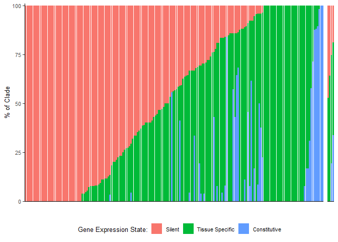
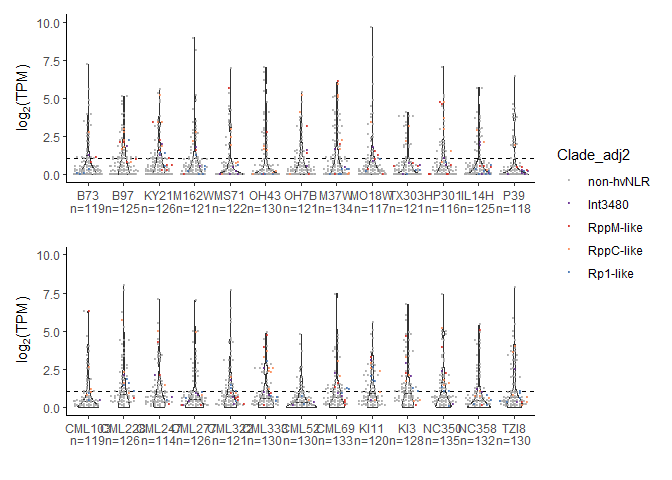

NLR Expression Figure
================
Chandler Sutherland
2023-11-17

Author: Chandler Sutherland Copyright (c) Chandler Sutherland Email:
<chandlersutherland@berkeley.edu>

Goal: Generate expression figures shown in Fig3 and Supplemental Figure
3

``` r
library(data.table)
library(ggplot2)
```

    ## Warning: package 'ggplot2' was built under R version 4.3.1

``` r
library(tidyverse)
```

    ## Warning: package 'purrr' was built under R version 4.3.1

    ## Warning: package 'dplyr' was built under R version 4.3.1

``` r
library(ggsignif)
library(ggpubr)
library(ggbeeswarm)
library(pheatmap)
```

    ## Warning: package 'pheatmap' was built under R version 4.3.1

``` r
library(patchwork)
```

    ## Warning: package 'patchwork' was built under R version 4.3.1

``` r
library(introdataviz)
library(viridis)
```

    ## Warning: package 'viridis' was built under R version 4.3.1

``` r
library(RColorBrewer)
```

Import and clean data

``` r
#remove unmappable NLRs 
unmappable <- c('Zm00039ab351270', 'Zm00026ab135540', 'Zm00036ab418650',
                'Zm00001eb091500', 'Zm00001eb164880', 'Zm00001eb343890',
                'Zm00001eb391100', 'Zm00001eb405870', 'Zm00001eb405900',
                'Zm00001eb405930', 'Zm00033ab429000', 'Zm00029ab367660')

#import gene information 
gene_table <- read.csv('Maize_NLRome_GeneTable.txt', sep='\t') %>% subset(select=c('Gene', 'Ecotype', 'HV', 'Clade'))
gene_table$Ecotype <- gene_table$Ecotype %>% toupper()
gene_table$Gene <- gene_table$Gene %>% 
  str_replace('ZM', 'Zm') %>% 
  str_replace('AB', 'ab') %>% 
  str_replace("EB", 'eb') %>% 
  str_replace('_P001', '')

#import nlr TPM table, average biological replicates 
all_tpm <- read.csv('//wsl.localhost//Ubuntu//home//chandlersutherland//e16_scratch//all_nlr_tissue.csv') %>% 
  filter(!tissue %in% c('endosperm', 'embryo')) %>% 
  filter(!name %in% unmappable) %>% 
  merge(gene_table, by.x='name', by.y='Gene')

all_tpm_avg <- all_tpm %>%
  group_by(Clade, HV, accession, tissue, name, chrom, chromStart, chromEnd, strand) %>%
  summarize(log2_TPM=mean(log2.TPM., na.rm = T)) %>%
  ungroup() 
```

    ## `summarise()` has grouped output by 'Clade', 'HV', 'accession', 'tissue',
    ## 'name', 'chrom', 'chromStart', 'chromEnd'. You can override using the `.groups`
    ## argument.

``` r
#clean up data for pretty plotting 
all_tpm_avg <- all_tpm_avg %>% mutate(HV=case_match(HV, 0 ~ "non-hv", 1~"hv")) #I don't know why this takes so long.. 
all_tpm_avg$HV <- factor(all_tpm_avg$HV, levels=c('non-hv', 'hv'))

write.csv(all_tpm_avg, 'all_tpm_avg.csv')
```

Create an expression matrix

``` r
#reformat tpm table 
#define a function that applies a sample ID based on the replicates
reformat <- function(split_df){
  #by_tissue <- split(split_df, split_df$tissue)
  split_df <- split_df  %>% group_by(rep) %>% mutate(sample_id=cur_group_id()) %>% mutate(tissue=paste(tissue, as.character(sample_id), sep='_'))
  split_df 
}

#define a function that applies reformat to each accession data frame 
by_tissue <- function(by_accession){
  one_acc <- lapply(split(by_accession, by_accession$tissue), reformat) %>% bind_rows()
  one_acc
}

#bring it all together 
all <- all_tpm  %>%  split(all_tpm$accession)
reformed <- lapply(all, by_tissue) %>% bind_rows() %>% subset(select=c(HV, accession, name, tissue, log2.TPM.)) %>%
  unique() %>%
  pivot_wider(names_from=tissue, values_from=log2.TPM.) %>% 
  remove_rownames() %>% 
  column_to_rownames('name')

#create an hv expression matrix 
p <- reformed %>% 
  filter(HV==1) %>% 
  subset(select=-c(HV, accession, tip_3, middle_3, root_3, base_3)) %>% #remove extra bioreps 
  filter_all(any_vars(. != 0))  %>% #remove genes with no variation across tissue types (would also remove all 0 genes)
  subset(select=c('root_1', 'root_2', 'ear_1', 'ear_2', 'shoot_1', 'shoot_2', 'base_1', 'base_2', 'tassel_1', 'tassel_2',
                  'anther_1', 'anther_2', 
                   'middle_1', 'middle_2', 'tip_1', 'tip_2'))
```

To define the gene expression categories, we compared TPM values across
the 10 tissues (leaf tip, leaf middle, leaf base, root, shoot, ear,
anther, tassel, endosperm, and embryo). We defined tissue-specific
expression as TPM ≥ 1 in at least 1 tissue and TPM \< 1 in at least 1
tissue, constitutive expression as TPM ≥ 1 in all 10 tissues, and silent
as TPM \< 1 in all 10 tissues.

``` r
by_category <- all_tpm %>% 
  group_by(accession, name, tissue, HV, chrom, chromStart,chromEnd, strand) %>%
  summarize(TPM=mean(TPM, na.rm=TRUE)) %>%
  mutate(HV=case_match(HV, 0 ~ "non-hv", 1~"hv")) %>%
  pivot_wider(names_from=tissue, values_from=TPM) %>%
  mutate(expr_category=case_when((
    (
      (anther >= 1) | (base >= 1) | (ear >= 1) | (middle >= 1) | (root >= 1) | (shoot >= 1) | (tip >= 1) | (tassel >=1)
      ) & 
      (
        (anther < 1) | (base < 1) | (ear < 1) | (middle < 1) | (root < 1) | (shoot < 1) | (tip < 1) | (tassel < 1)
        )
    )  ~'tissue_specific',
    (
      (anther >= 1) & (base >= 1) & (ear >= 1) & (middle >= 1) & (root >= 1) & (shoot >= 1) & (tip >= 1) & (tassel >=1)
      ) ~ 'constitutive',
    (
      (anther < 1) & (base < 1) & (ear < 1) & (middle < 1) & (root < 1) & (shoot < 1) & (tip < 1) & (tassel < 1)
      ) ~ 'silent'))
```

    ## `summarise()` has grouped output by 'accession', 'name', 'tissue', 'HV',
    ## 'chrom', 'chromStart', 'chromEnd'. You can override using the `.groups`
    ## argument.

``` r
by_category$HV <- factor(by_category$HV, levels=c('non-hv','hv'))


all_tpm_avg <- by_category %>% subset(select=c(name, expr_category)) %>% unique() %>% merge(all_tpm_avg) %>% 
  mutate(Clade_adj=recode(Clade, 'Int3480_75_130_L_68'='Int3480', 
                          'Int4787_129_172_L_83'='RppM-like', 
                          'Int6329_131_253_L_122_209_L_80_142_L_61'='RppC-like', 'Int6329_131_253_L_122_209_R_35_43_R_23'='RppC-like',
                          'Int6329_131_253_L_122_209_L_80_142_R_18'='RppC-like',
                          'Int6648_150_178_L_128_144_R_93'='Rp1-like'))

write_csv(all_tpm_avg, file="C://Users//chand//Box Sync//Krasileva_Lab//Research//chandler//Krasileva Lab//E16//intermediate_data//nlr_tpm.csv")

coordinates <- all_tpm_avg %>% 
  subset(select=c('accession', 'name', 'Clade_adj', 'HV', 'expr_category', 'chrom', 'chromStart', 'chromEnd', 'strand')) %>% 
  unique()

write_csv(coordinates, file="C://Users//chand//Box Sync//Krasileva_Lab//Research//chandler//Krasileva Lab//E16//intermediate_data//nlr_coords.csv")
```

## Fig 3A: per clade percentage category

``` r
all_tpm_avg$expr_category <- factor(all_tpm_avg$expr_category, levels=c('silent', 'tissue_specific', 'constitutive'))  

cat_plot <- all_tpm_avg %>% 
  group_by(HV, Clade_adj, expr_category) %>% 
  summarize(n=n()) %>% 
  mutate(prop=n/sum(n)*100) %>% 
  ungroup()%>%
  group_by(HV, expr_category) %>% 
  mutate(rank=rank(prop)) %>%
  mutate(Clade_adj=reorder(Clade_adj, -rank)) %>%
  ungroup()
```

    ## `summarise()` has grouped output by 'HV', 'Clade_adj'. You can override using
    ## the `.groups` argument.

``` r
#sample size of clades 
sample_size <- cat_plot %>% subset(select=c(HV, Clade_adj)) %>% unique() %>% group_by(HV) %>% summarize(n=n()) %>% pull(n)
xlabel <- paste(c('Clade\nn=',
                  as.character(sample_size[[1]]), 
                  ' non-hvNLRs, ', 
                  as.character(sample_size[[2]]), 
                  ' hvNLRs'), 
                sep='', collapse='')

#print order of hv clades 
cat_plot %>% filter(HV=='hv') %>% pull(Clade_adj) %>% unique()
```

    ## [1] Int3480   Rp1-like  RppC-like RppM-like
    ## 188 Levels: Int3452_26 Int3480_75_130_R_1 ... RppC-like

``` r
by_category_plot <- cat_plot  %>%
  ggplot(aes(x=Clade_adj, y=prop, fill=expr_category))+
  geom_col()+
  facet_grid(~HV, scales='free', space='free')+
  ylab('% of Clade')+
  xlab('')+
  scale_fill_discrete(name = "Gene Expression State:", labels = c("Silent", "Tissue Specific", "Constitutive"))+
  theme_classic()+
  scale_y_continuous(limits = c(0,101), expand = c(0, 0)) +
  theme(axis.text.x = element_blank(),
        legend.position = 'bottom',
        text = element_text(size=10),
        axis.ticks.x = element_blank(),
        strip.background = element_blank(),
        strip.text.x = element_blank()
        )


by_category_plot 
```

<!-- -->

``` r
ggsave(by_category_plot, filename='C://Users//chand//Box Sync//Krasileva_Lab//Research//chandler//Krasileva Lab//E16//figure panels//expression_by_category.svg', width=160, height=60, units='mm')
```

## Fig 3B: Heatmap

``` r
#apply clade membership from geneTable
row_annotation <- all_tpm_avg %>%
  filter(HV=='hv') %>% 
  subset(select=c(name, accession, Clade_adj, expr_category)) %>% 
  unique() %>% 
  subset(select=c(name,  
                  expr_category, 
                  Clade_adj
                  )) %>% 
  remove_rownames() %>% 
  column_to_rownames('name')

#get gene lists for each hv clade
Int3480 <- row_annotation %>% filter(Clade_adj=='Int3480') %>% rownames()
Rp1 <- row_annotation %>% filter(Clade_adj=='Rp1-like') %>% rownames()
RppM <- row_annotation %>% filter(Clade_adj=='RppM-like') %>% rownames()
RppC <- row_annotation %>% filter(Clade_adj=='RppC-like') %>% rownames()

#remove clade name from row annotation
row_annotation <- row_annotation %>% subset(select=c(expr_category))

#create column annotations
samples <- colnames(p)
col_annotation <- as.data.frame(samples) %>% separate(samples, '_', into=c('tissue', NA), remove=F) %>% column_to_rownames('samples')

#create color annotation list 
my_col = list(expr_category=c('tissue_specific'='#00BA38', 
                  'silent'= '#F8766D',
                  'constitutive'='#619CFF'
                  ),
  tissue=c('anther'="#FFD92F", 
           'base'="#E78AC3", 
           'ear'="#FC8D62", 
           'middle'="#E5C494", 
           'root'="#66C2A5", 
           'shoot'="#8DA0CB", 
           'tassel'="#A6D854", 
           'tip'="#B3B3B3"))

#standardize mat breaks to I can create each heatmap individually 
mat_breaks <- seq(min(p, na.rm=TRUE), max(p, na.rm=TRUE), length.out = 100)
```

``` r
#plot! 
Int3480_m <- p[rownames(p) %in% Int3480,]
pheatmap(Int3480_m, 
         cluster_cols=FALSE,
         gaps_col=c(2, 4, 6, 8, 10, 12, 14),
         show_rownames=FALSE,
         show_colnames=FALSE,
         annotation_row=row_annotation, 
         annotation_colors=my_col, 
         cellheight=2.5, cellwidth=10, 
         border_color=NA,
         legend=FALSE,
         annotation_legend=FALSE, 
         annotation_names_row=FALSE,
         treeheight_row=60,
         breaks=mat_breaks, 
        filename='C://Users//chand//Box Sync//Krasileva_Lab//Research//chandler//Krasileva Lab//E16//figure panels//Int3480_2.png',
        color=inferno(100))

Rp1_m <- p[rownames(p) %in% Rp1,]
pheatmap(Rp1_m, 
         cluster_cols=FALSE, 
         show_rownames=FALSE, 
         show_colnames=FALSE,
         gaps_col=c(2, 4, 6, 8, 10, 12, 14),
         annotation_row=row_annotation, 
         annotation_colors=my_col, 
         cellheight=2.5, cellwidth=10, 
         legend=FALSE,
         annotation_legend=FALSE, 
         annotation_names_row=FALSE,
         border_color=NA,
         breaks=mat_breaks, 
         color=inferno(100),
         filename='C://Users//chand//Box Sync//Krasileva_Lab//Research//chandler//Krasileva Lab//E16//figure panels//Rp1_2.png',
         treeheight_row=60
         )

RppM_m <- p[rownames(p) %in% RppM,]
pheatmap(RppM_m, 
         cluster_cols=FALSE, 
         show_rownames=FALSE, 
         show_colnames=FALSE,
         gaps_col=c(2, 4, 6, 8, 10, 12, 14),
         annotation_row=row_annotation, 
         annotation_colors=my_col, 
         cellheight=2.5, cellwidth=10, 
         legend=FALSE,
         annotation_legend=FALSE, 
         annotation_names_row=FALSE,
         annotation_names_col=FALSE,
         border_color=NA,
         annotation_col=col_annotation, #as the leftmost plot it gets the color annotation 
         breaks=mat_breaks, 
         color=inferno(100), 
        filename='C://Users//chand//Box Sync//Krasileva_Lab//Research//chandler//Krasileva Lab//E16//figure panels//RppM_2.png',
         treeheight_row=60
         )


RppC_m <- p[rownames(p) %in% RppC,]
pheatmap(RppC_m, 
         cluster_cols=FALSE, 
         show_rownames=FALSE, 
         gaps_col=c(2, 4, 6, 8, 10, 12, 14),
         annotation_row=row_annotation, 
         annotation_colors=my_col, 
         cellheight=2.5, cellwidth=10, 
         legend=FALSE,
         annotation_legend=FALSE, 
         annotation_names_row=FALSE,
         breaks=mat_breaks, 
         color=inferno(100),
         show_colnames = FALSE,
         treeheight_row=60,
         filename='C://Users//chand//Box Sync//Krasileva_Lab//Research//chandler//Krasileva Lab//E16//figure panels//RppC_2.png',
         border_color=NA)

#using this for the legend 
pheatmap(RppC_m, 
         cluster_cols=FALSE, 
         show_rownames=FALSE, 
         gaps_col=c(2, 4, 6, 8, 10, 12, 14),
         annotation_row=row_annotation, 
         annotation_colors=my_col, 
         cellheight=2.5, cellwidth=10, 
         legend=TRUE,
         annotation_legend=TRUE, 
         annotation_names_row=FALSE,
         breaks=mat_breaks, 
         color=inferno(100),
         show_colnames = TRUE,
         treeheight_row=60,
         filename='C://Users//chand//Box Sync//Krasileva_Lab//Research//chandler//Krasileva Lab//E16//figure panels//legend.png',
                 border_color=NA
         )
```

## Supplemental Fig 3

Goal: create a standard violin plot between accessions in leaf tissue

``` r
#import subpopulation information 
subpopulations <- read_table('//wsl.localhost//Ubuntu//home//chandlersutherland//e16//nam_genome_info.txt',
                             col_names=c('Assembly', 'Grin', 'accession_id', 
                                         'source', 'cross_reference', 'subpopulation', 'stock'), skip=1) %>%
  separate(Assembly, sep='-', into=c(NA, 'accession', NA, NA, NA))
```

    ## 
    ## ── Column specification ────────────────────────────────────────────────────────
    ## cols(
    ##   Assembly = col_character(),
    ##   Grin = col_character(),
    ##   accession_id = col_double(),
    ##   source = col_character(),
    ##   cross_reference = col_character(),
    ##   subpopulation = col_character(),
    ##   stock = col_character()
    ## )

    ## Warning: 25 parsing failures.
    ## row col  expected    actual                                                                          file
    ##   1  -- 7 columns 8 columns '//wsl.localhost//Ubuntu//home//chandlersutherland//e16//nam_genome_info.txt'
    ##   2  -- 7 columns 8 columns '//wsl.localhost//Ubuntu//home//chandlersutherland//e16//nam_genome_info.txt'
    ##   3  -- 7 columns 8 columns '//wsl.localhost//Ubuntu//home//chandlersutherland//e16//nam_genome_info.txt'
    ##   4  -- 7 columns 8 columns '//wsl.localhost//Ubuntu//home//chandlersutherland//e16//nam_genome_info.txt'
    ##   5  -- 7 columns 8 columns '//wsl.localhost//Ubuntu//home//chandlersutherland//e16//nam_genome_info.txt'
    ## ... ... ......... ......... .............................................................................
    ## See problems(...) for more details.

``` r
subpopulations$accession <- subpopulations$accession %>% toupper()
subpopulations <- subpopulations %>% subset(select=c('accession', 'subpopulation'))
subpopulations[nrow(subpopulations) + 1,] = list('B73', 'Stiff stalk')
subpopulations <- subpopulations %>% 
  mutate(subpopulation =recode(subpopulation, 'Temporate/tropical'='Mixed', 
                               'Temporate/Tropical'='Mixed',
                               'Non-stiff-stalk'='Non-stiff stalk', 
                               'Sweet'='Sweetcorn'))

subpopulations$subpopulation <- factor(subpopulations$subpopulation, 
                                       levels=c('Stiff stalk', 'Non-stiff stalk', 
                                                'Mixed', 'Popcorn', 'Sweetcorn', 'Tropical'))

# y axis label
y_label <- expression('log'[2]*'(TPM)')

# group non-hvNLRs for ease of color plotting, add subpopulation information for grouping, then filter to just middle leaf tissue 
sfig3<- all_tpm_avg %>% 
  mutate(Clade_adj2=recode(Clade_adj, 'Int3480'='Int3480', 
                              'RppM-like'='RppM-like', 
                              'RppC-like'='RppC-like', 
                              'Rp1-like'='Rp1-like', 
                            .default='non-hvNLR')) %>%
  merge(subpopulations) %>% 
  arrange(subpopulation) %>%
  filter(tissue=='middle')

#add sample size of #NLRs to label 
sample_size <- sfig3 %>% 
  group_by(accession) %>% 
  summarize(n=n()) %>% 
  mutate(label=paste(accession, '\nn=', as.character(n), sep='')) %>% 
  ungroup() 

#factor and order
sfig3 <- merge(sfig3, sample_size)
subpop_order <- sfig3 %>% arrange(subpopulation) %>% pull(label) %>% unique()
sfig3$label <- factor(sfig3$label, levels=subpop_order)
sfig3$Clade_adj2 <- factor(sfig3$Clade_adj2, levels=c('non-hvNLR', 'Int3480', 'RppM-like', 'RppC-like', 'Rp1-like'))

#separate out tropical from the rest 
p1 <- sfig3 %>% filter(subpopulation != 'Tropical')
p2 <- sfig3 %>% filter(subpopulation == 'Tropical')

seventy_five <- sfig3 %>% pull(log2_TPM) %>% quantile(c(0.75))
```

ggbeeswarm behaves poorly with faceting, so add labels manually

``` r
non_tropical <- ggplot(p1 %>% arrange(Clade_adj2), aes(x=label, y=log2_TPM))+ 
  geom_violin(trim=T,
            #  alpha = 0.4,
              scale='count' , 
            #  draw_quantiles = c(0.5)
           )+
  geom_hline(aes(yintercept=seventy_five), linetype=2)+
  geom_beeswarm(aes(color=Clade_adj2), 
                corral='random', 
                corral.width=0.8,
                cex=1,
                method='hex',
                priority='density',
                alpha=0.75,
                size=0.4)+
  scale_color_manual(values=c('Int3480'='#662d91', 
                              'RppM-like'='#d73027', 
                              'RppC-like'='#fc8d59', 
                              'Rp1-like'='#4575b4', 
                            'non-hvNLR'='darkgrey'))+
  ylab(y_label)+
  xlab('')+
  theme(legend.title=element_blank(),
        legend.position='none',
        text = element_text(size=10))+
  ylim(-0.01,10)+
  theme_classic() 

tropical <- ggplot(p2 %>% arrange(Clade_adj2), aes(x=label, y=log2_TPM))+ 
  geom_violin(trim=T,
             # alpha = 0.4,
              scale='count', 
              draw_quantiles = c(0.5))+
    geom_hline(aes(yintercept=seventy_five), linetype=2)+
  geom_beeswarm(aes(color=Clade_adj2), 
                corral='random', 
                corral.width = 0.8,
                cex=1,
                method='hex',
                priority='density',
                alpha=0.75,
                size=0.4)+
  scale_color_manual(values=c('Int3480'='#662d91', 
                              'RppM-like'='#d73027', 
                              'RppC-like'='#fc8d59', 
                              'Rp1-like'='#4575b4', 
                            'non-hvNLR'='darkgrey'))+
  ylab(y_label)+
  ylim(-.01,10)+
  xlab('')+
  theme(legend.title=element_blank(),
        legend.position='none',
        text = element_text(size=10))+
  theme_classic() 

middle <- non_tropical + tropical + plot_layout(ncol=1, guides='collect')

middle
```

    ## Warning: In `position_beeswarm`, method `hex` discretizes the data axis (a.k.a the
    ## continuous or non-grouped axis).
    ## This may result in changes to the position of the points along that axis,
    ## proportional to the value of `cex`.
    ## This warning is displayed once per session.

    ## Warning: Removed 524 rows containing missing values (`geom_point()`).

<!-- -->

``` r
ggsave(middle, filename='C://Users//chand//Box Sync//Krasileva_Lab//Research//chandler//Krasileva Lab//E16//figure panels//middle.png', width=250, height=150, units='mm')
```

    ## Warning: Removed 524 rows containing missing values (`geom_point()`).
